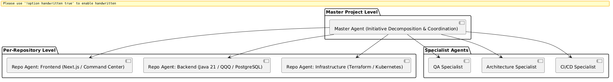

# Concilium

Master-agent orchestration platform for multi-repository software delivery.

Concilium coordinates planning, issue-backed work, architecture awareness, and delivery convergence across multiple repos using persistent AI agents. It introduces the concept of a **Master Project**: a single logical software system composed of multiple repositories, each with a persistent **Repo Agent**, coordinated by a **Master Agent**.

## Key Concepts

- **Master Project** -- Groups multiple repos into one logical software system with shared goals, architecture, and delivery status.
- **Master Agent** -- Persistent coordinating intelligence for a Master Project. Decomposes initiatives, assigns work, tracks progress.
- **Repo Agent** -- Persistent agent per repository. Deeply understands its codebase, executes assigned work, reports results.
- **Specialist Agents** -- Optional agents for QA, architecture, CI/CD, documentation, and release coordination.

Concilium is **planner/coordinator first**. It is not a coding chatbot. Its role is to orchestrate planning, issue-backed work, architecture awareness, and delivery convergence.

## Architecture & Agent Coordination



| Layer | Technology |
|---|---|
| Backend | Java 21, QQQ Framework, Javalin |
| Frontend | Next.js, React, Tailwind CSS, React Flow |
| Database | PostgreSQL 17 |
| Agent Execution | Claude Code CLI (heavy reasoning) + Claude API (lightweight tasks) |
| Object Storage | S3-compatible (MinIO for dev) |
| CI/CD | CircleCI + Munitor |
| Issue Tracking | GitHub Issues |

**Gradle modules:** `concilium-core`, `concilium-orchestration`, `concilium-integrations`, `concilium-memory`, `concilium-server`

See the [Design Spec](docs/superpowers/specs/2026-03-22-concilium-bootstrap-design.md) for full architecture details.

## Quick Start

### Prerequisites

- Java 21
- Node.js 22+
- Docker and Docker Compose
- [QQQ](https://github.com/Kingsrook/qqq) 0.40.0-SNAPSHOT installed to mavenLocal

### Local Development

```bash
# Start everything (Postgres, MinIO, backend, frontend)
docker/start-local-dev.sh

# Or start services only, run app from IDE
docker/start-local-dev.sh --no-frontend

# Stop everything
docker/stop-local-dev.sh
```

### Services

| Service | URL |
|---|---|
| Backend API + Admin | http://localhost:8000 |
| Frontend (Command Center) | http://localhost:3000 |
| PostgreSQL | localhost:5456 (devuser/devpass) |
| MinIO Console | http://localhost:9031 (minioadmin/minioadmin) |

### Build

```bash
# Build backend
./gradlew build

# Build frontend
cd frontend && npm run build

# Build deployable JAR
./gradlew :concilium-server:shadowJar

# Run tests
./gradlew test
```

## Project Status

Concilium is in active early development (Phase 1: MVP).

Track progress on the [Project Board](https://github.com/users/KofTwentyTwo/projects/3).

## Contributing

See [CONTRIBUTING.md](CONTRIBUTING.md) for development workflow, coding conventions, and how to submit changes.

## Security

See [SECURITY.md](SECURITY.md) for reporting vulnerabilities.

## Code of Conduct

See [CODE_OF_CONDUCT.md](CODE_OF_CONDUCT.md).

## License

This project is licensed under the [GNU General Public License v3.0](LICENSE).
